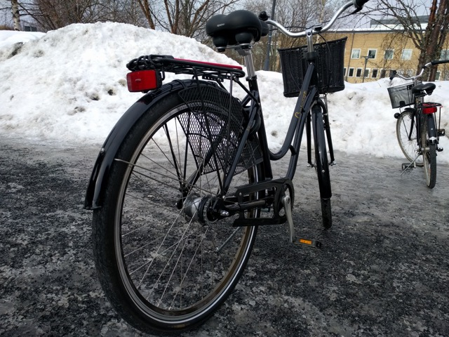
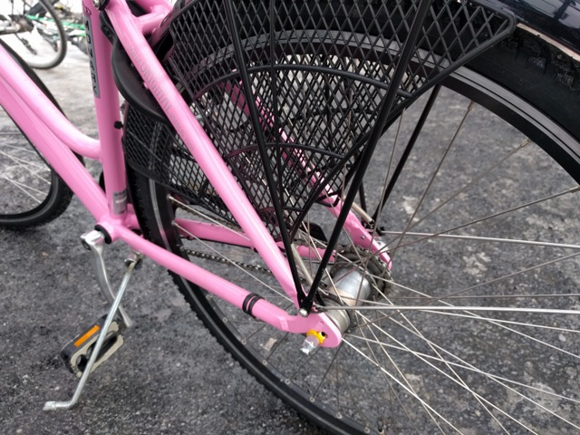
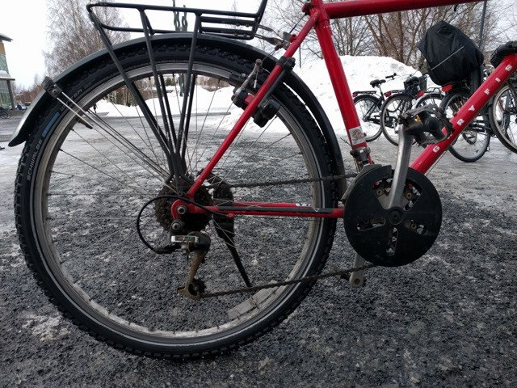
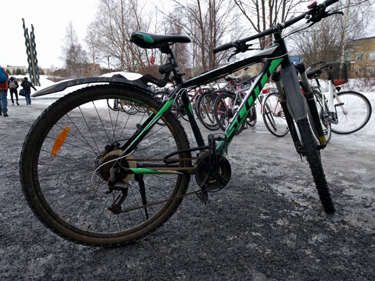
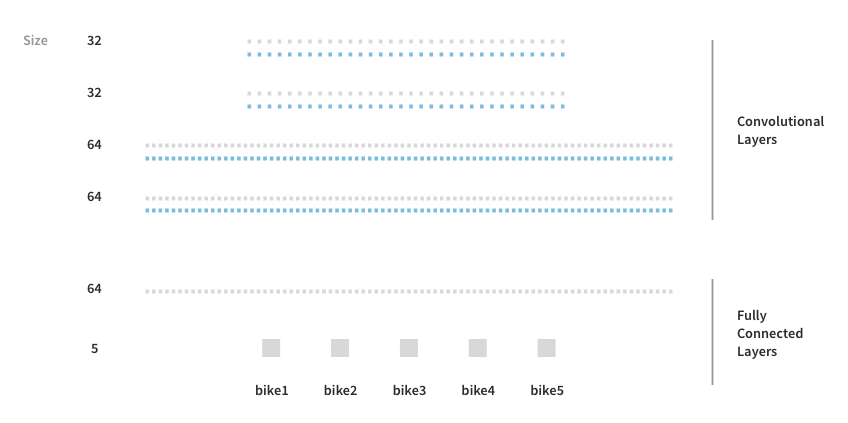

# keras-bike-recognition
A bike classifier consisting of a convolutional neural network made in Keras with TensorFlow backend.

This was an assignment in the Machine Learning class at Umeå University, spring 2018. 

The idea is to take images of your and your friends bicycles, in order to train a neural network so that you later can use it if your bike has been stolen and uploaded to an online marketplace. My network stack got an highest evaluation score of 92% with a small training set of 20 images. 




# Prerequisites
* Jupyter Notebook running Python 2.7 (Preferably installed via [Anaconda](https://www.anaconda.com/download/)

Install required packages via conda and pip and create a new kernel.
```
conda update anaconda
conda create -n ipykernel_py2_ml python=2 ipykernel
source activate ipykernel_py2_ml
conda install keras tensorflow numpy gensim h5py nltk matplotlib pandas seaborn
pip install sklearn
```

# Run
Clone to your computer, and run 
``` 
jupyter notebook keras-bike-recognition.ipynb
``` 
This will open up Jupyter Notebook on port 8888. Run the cells from top to bottom in order to classify the bike images.

# Task
The assignment was ment to be similar to a real world machine learning task, so images were collected by me and my friends outside Umeå University.

We later trained our network on our images and tweaked our network to achieve a high score.

# Network 
The convolutional neural network consists of 12 layers
* 4 Convulutional Layers, 32-32-64-64 outputs, 5x5 kernel, Rectifier Activation.
* Together with 4 Max Pooling Layer, 2x2 pooling size

* 2 fully connected layers with a dropout layer in between (0.5 dropout).
* The last connected layer has a softmax activation for classification



Loss function was categorical crossentropy
Optimizer was Adam Optimizer

The network ran for 5 epochs and received a score ranging from 60-92%
