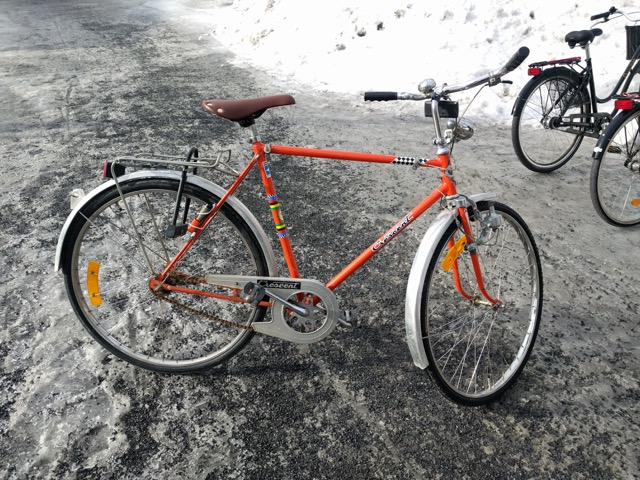

# keras-bike-recognition
A bike classifier consisting of a convolutional neural network made in Keras with TensorFlow backend.

This was an assignment in the Machine Learning class at Umeå University, spring 2018. 

The idea is to take images of your and your friends bicycles, in order to train a neural network so that you later can use it if your bike has been stolen and uploaded to an online marketplace. My network stack got an highest evaluation score of 92% with a small training set of 20 images. 



# Prerequisites
* Jupyter Notebook running Python 2.7 (Preferably installed via [Anaconda](https://www.anaconda.com/download/)

Install required packages via conda and pip and create a new kernel.
```
conda update anaconda
conda create -n ipykernel_py2_ml python=2 ipykernel
source activate ipykernel_py2_ml
conda install keras tensorflow numpy gensim h5py nltk matplotlib pandas seaborn
pip install sklearn
```

# Run
Clone to your computer, and run 
``` 
jupyter notebook keras-bike-recognition.ipynb
``` 
This will open up Jupyter Notebook on port 8888. Run the cells from top to bottom in order to classify the bike images.
